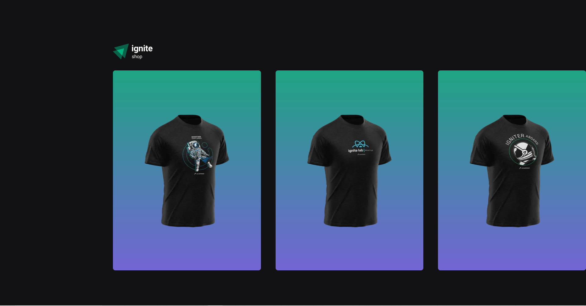
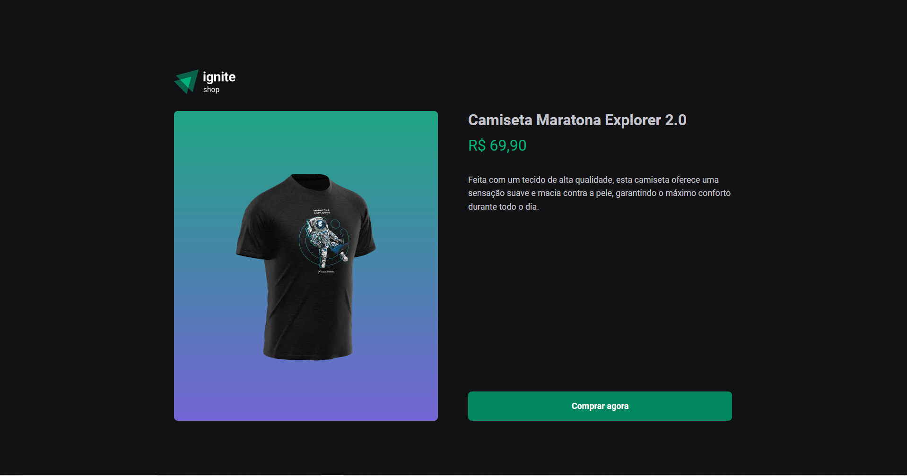
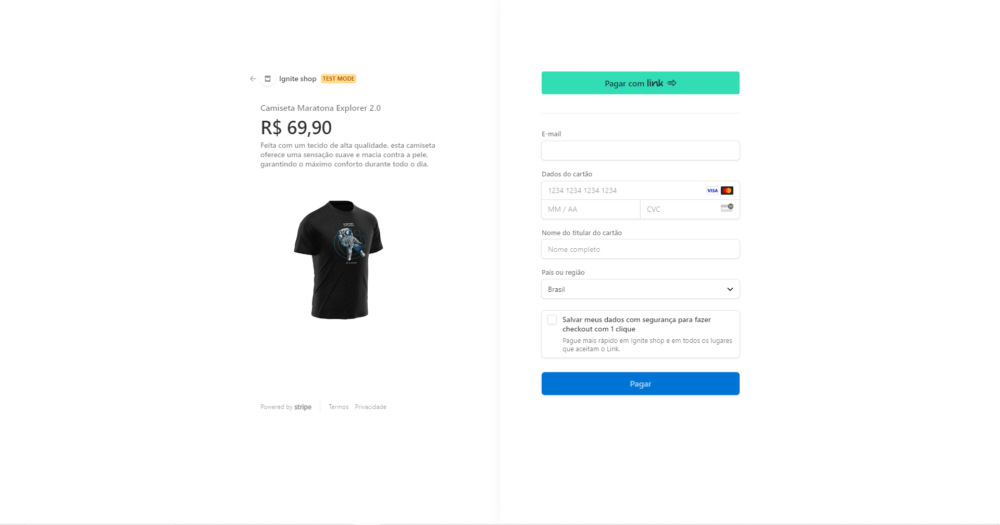
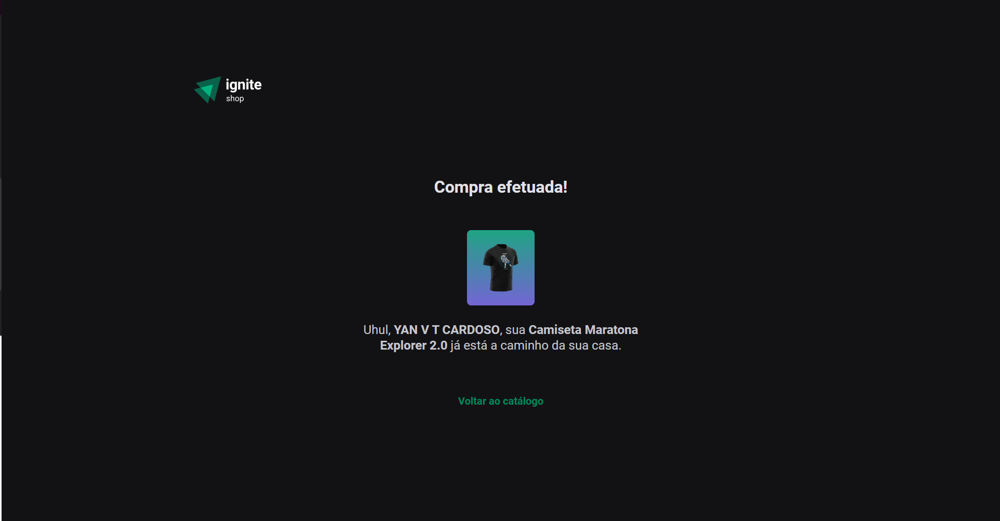

<h1 align="center"> Ignite Shop </h1>

🔨 Tools: Typescript, React.js, Next.js, Axios, Stripe
#

# Get started

To use the project, after downloading it you must run install all the dependencies. To do that, run the following command:

```
npm install
```

<br/>

To see the project running, you can run the following command:

```
npm run dev
```
<br/>

After that, you should be able to access the application in the address: 
<br>
[http://localhost:3000/](http://localhost:3000/)

#
The project is integrated with Stripe, so you will need an account to use 100% of this project
<br/>
[Stripe 🔗](https://stripe.com/br)
#

# Preview

## Home page
<p align="center">
  
</p>

## Product Details page
<p align="center">
  
</p>

## Product Purchase page
<p align="center">
  
</p>

## Success Purchase page
<p align="center">
  
</p>

